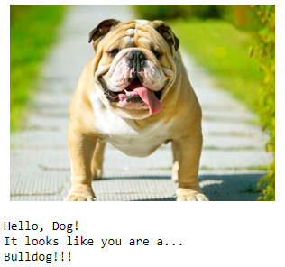

# Udacity Deep Learning Nanodegree Project: Dog Classification

## Description
This is second project of **Udacity Deep Learning Nanodegree**.
The objective of this project is, build a CNN model for dog breed classification, building your own CNN model with and without pre-trained architectures like VGG16 for example.

## Original Repository
[Click here](https://github.com/udacity/deep-learning-v2-pytorch/tree/master/project-dog-classification)
